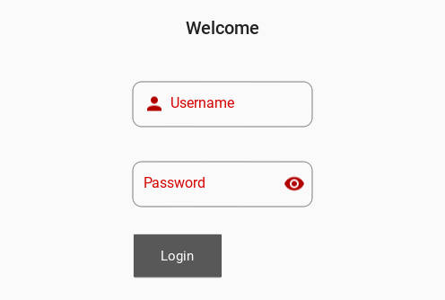
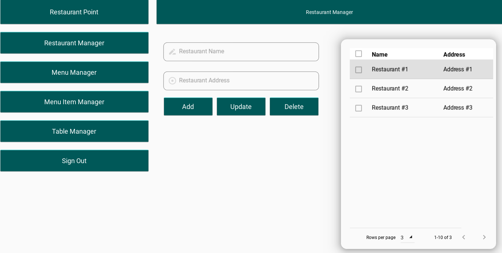

# Simple Vehicle Shop Management Application

This repository contains a Python application designed to manage restaurants,restaurant menus, menu items
and tables. The application provides a responsive and intuitive user interface. 

## Key Features

- **Restaurant Management**: Manage multiple restaurants efficiently within the application.
- **Menu Management**: Create and update restaurant menus with ease, ensuring the latest offerings are always available.
- **Menu Item Management**: Add, edit, or remove menu items, providing flexibility to keep the menu up-to-date.
- **Table Management**: Organize and manage tables for each restaurant, helping to streamline operations.
- **Order Management**: Seamlessly place and manage orders, improving the ordering process for both staff and customers.
- **Invoice Printing**: Generate and print invoices directly from the application, simplifying billing and record-keeping.
- **User Authentication**: Includes a secure login section to ensure that only authorized users can access the application.
- **PostgreSQL Integration**: Utilizes PostgreSQL as the database for storing and managing all data related to restaurants, menus, menu items, tables, and orders.

## Technologies Used

- **Python**: The application is built using Python, a versatile and powerful programming language.
- **Kivy and KivyMD**: Leveraging the Kivy and KivyMD libraries, the application offers a responsive and visually appealing user interface.
- **Git**: The project utilizes Git for version control, facilitating collaboration and code management.
- **PostgreSQL**: Used as the database for posting, retrieving, updating, and deleting records.

## Usage

To get started with the application:

1. Clone the repository to your local machine.
2. Install the required dependencies using pip.
3. Run the following code to start the application py/python view.py
4. Put the following informations, Username: 1, Password: 1

## License

This project is licensed under the MIT License - see the [LICENSE](LICENSE) file for details.
